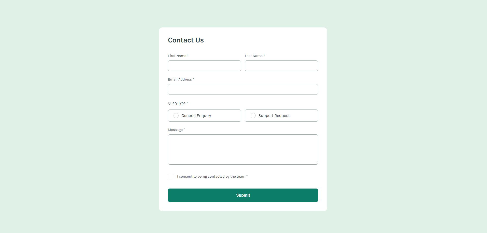

# Frontend Mentor - Contact form solution

This is a solution to the [Contact form challenge on Frontend Mentor](https://www.frontendmentor.io/challenges/contact-form--G-hYlqKJj). Frontend Mentor challenges help you improve your coding skills by building realistic projects.

## Table of contents

- [Overview](#overview)
  - [The challenge](#the-challenge)
  - [Screenshot](#screenshot)
  - [Links](#links)
- [My process](#my-process)
  - [Built with](#built-with)
  - [What I learned](#what-i-learned)
  - [Continued development](#continued-development)
- [Author](#author)

## Overview

Build out this contact form and get it looking as close to the design as possible. Pay particular attention to making this form accessible. Building accessible forms is a key skill for front-end developers. So this is a perfect challenge to practice.

You can use any tools you like to help you complete the challenge. So if you've got something you'd like to practice, feel free to give it a go.

### The challenge

Users should be able to:

- Complete the form and see a success toast message upon successful submission
- Receive form validation messages if:
  - A required field has been missed
  - The email address is not formatted correctly
- Complete the form only using their keyboard
- Have inputs, error messages, and the success message announced on their screen reader
- View the optimal layout for the interface depending on their device's screen size
- See hover and focus states for all interactive elements on the page

### Screenshot



### Links

- Solution URL: [GitHub Repo](https://github.com/jmmarketing/contact-form-FEM)
- Live Site URL: [Add live site URL here](https://jmmarketing.github.io/contact-form-FEM/)

## My process

This was a build from scratch process. No libraries, just HTML/SCSS/Javascript. Started with reviewing the style-guide & figma files, then determining best route for my foundation. In this case I took the approach of:

- Buildout basic file structure for the project, laying out any base/abstract/component files I will need.
- Using Figma/Style-guide setting up our variables file for colors & spacing.
- Built out the HTML using BEM naming conventions.
- SCSS was built out taking a Desktop first approach. Only styling, no states.
- Once styling was done, started building out error/hover/active states.
- Went back and started editing responsiveness wehre I could. Wanted to keep it minimal using flex/clamp and %/vh/vw when possible and made sense.
- JS was started last. Used a class style with a single SubmitForm class that is initialized with my event listeners.
- Within SubmitForm I set up a few element selectors, a \_data object for input, and a few methods (clear,validate, success) as well as a basic helper.js file that held our Validate object.
- Started testing out each scenario indepenedently and then created our logical statements on when/how to trigger.
- Lastly, started testing various user paths (different ways form and can be filled out) and corrected them as they were found.

### Built with

- Semantic HTML5 markup
- SCSS
- Flexbox
- Desktop-first workflow
- ES6 Module

### What I learned

I used this project to really focus on using CSS to trigger states of our input. While there is some minimal JS for validating and adding a class, almost all of the error, sucess states are done via psuedo-selectors(:has()) and combinators (+, ~, >,etc..). The combination of class, psuedo, and combinator can be impressive. It did require some re-working of our HTML/BEM strategy.

Here is an example with the first_name input:

```html
<div class="form__input-name">
  <label for="first_name" class="form__label"
    >First Name <span class="form__label--required">*</span></label
  >
  <input
    type="text"
    name="first_name"
    class="form__input"
    title="This field is required"
    required
  />
  <span class="form__error-message">This field is required</span>
</div>
```

```css
.form__input-name {
  display: flex;
  flex-direction: column;
  align-items: flex-start;
  gap: $spacing-100;

  align-self: stretch;
  flex: 1 1 48%;

  min-width: 270px;

  &:focus-within {
    color: $color-green-600;
  }

  &:has(input.invalid) .form__error-message {
    display: block;
  }
}
```

```js

  _data = {
    first_name: false,
    last_name: false,
    email: false,
    enquiry: false,
    message: false,
    consent: false,
  };

 _validateInputs(e) {
    e.preventDefault();
    for (const input of this._formInputs) {

      const inputName = input.name;
      const inputType = input.type;
      const buttonInput = inputType == "radio" || inputType == "checkbox";
      const inputValue = buttonInput ? input.checked : input.value;
      const isValid = buttonInput
        ? input.checked
        : this._data.hasOwnProperty(inputName) &&
          VALIDATE[`${inputType || inputName}`](inputValue);

      if (!isValid && !this._data[inputName]) {

        input.classList.add("invalid");
      }

      if (isValid) {
        this._data[inputName] = isValid;
        input.classList.remove("invalid");

        if (inputType == "radio") {
          document
            .querySelectorAll('input[type="radio"]')
            .forEach((input) => input.classList.remove("invalid"));
        }
      }
    }
 }
```

### Continued development

I want to continue learning how to get the most out of CSS without JS. Getting more familiar with all psuedo-classes/elements & combinators would really help speed up workflows.

Additionally, I should take basic examples like this create a simple MVC designed component out of it. It may be overkill for this, but in the long run being comfortable with the flow of model <--> controller <--> view is an absolute must. Especially before jumping into more abstracted frameworks.

## Author

- Website - [Jeffrey McLean | San Diego Digital Consultant](https://jeffreymclean.com)
- Frontend Mentor - [@jmmarketing](https://www.frontendmentor.io/profile/jmmarketing)
- Twitter - [@jeffe_mclean](https://www.twitter.com/jeffe_mclean)
